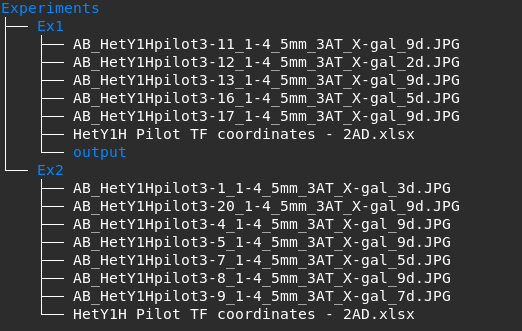

# Detection of Interactions Software for High-throughput Analysis

An automated tool to detect and analyze yeast-based assays to learn more about transcriptional regulation in immune
responses and cancer.

The current version uses segmentation model trained on a dataset generated by my manual colony extraction algorithm. The dataset was generated by running different configuration of the manual algorithm and randomly sampling patches from the output images. I created a tool to either include or reject those random samples and populate the dataset.

## Instructions

### System Requirements

This software is mainly for processing large batches of images on a high-performance server like the SCC at BU. However, any system with CUDA-compatible GPU should be able to run this software.  OS: Linux / Windows / Mac. *The software does not support the Apple SoC currently.

### Installation

The environment setup takes 5-10, and software installation takes ~1 minute with high-speed internet.

#### Install Anaconda

Install and setup Anaconda distribution following the instructions from the [official documentation](https://docs.anaconda.com/free/anaconda/install/index.html)).

#### Environment Setup

Create an environment called disha with pyside2 and python (version 3.10)

```bash
conda create -n disha pyside2 python = 3.10
conda activate disha
```

The software requires a GPU to work efficiently. Setup CUDA toolkit and Tensorflow.

```bash
conda install -c conda-forge cudatoolkit=11.8.0
python3 -m pip install nvidia-cudnn-cu11==8.6.0.163 tensorflow==2.9.1

# Following instructions are adapted from official tensorflow documentation and are only necessary for linux distributions.
# You can skip them if you are on different operating system.
mkdir -p $CONDA_PREFIX/etc/conda/activate.d
echo 'CUDNN_PATH=$(dirname $(python -c "import nvidia.cudnn;print(nvidia.cudnn.__file__)"))' >> $CONDA_PREFIX/etc/conda/activate.d/env_vars.sh
echo 'export LD_LIBRARY_PATH=$LD_LIBRARY_PATH:$CONDA_PREFIX/lib/:$CUDNN_PATH/lib' >> $CONDA_PREFIX/etc/conda/activate.d/env_vars.sh
source $CONDA_PREFIX/etc/conda/activate.d/env_vars.sh

# Verify install; Following line should print your GPU name if it was correctly setup:
python3 -c "import tensorflow as tf; print(tf.config.list_physical_devices('GPU'))"
```

Clone Repository and install the software

```bash
git clone https://github.com/mahir1010/D.I.S.H.A
cd disha
python -m pip install build --upgrade
python -m build
python -m pip install ./dist/<replace with .whl file name>
```

This will create two entry points for the software ```disha-verify``` to verify folder structure and ```disha-analyzer``` that processes the data.

### Segmentation Model Weights and sample data

We provide our model weights and sample data [here](https://drive.google.com/drive/folders/1oZFCNsfJE_BUgq3KdY4buXx3_B-0tXht?usp=share_link). Users can also use their own model.

### Folder Structure

Create a root folder that will contain all the experiments.

Each experiment should have its own folder containing all images and an Excel file containing details about coordinates and transcription factor pairs.

The images should have the following format:

<br>```<text>_<experiment name>-<bait number>_<plate number "x-x">_<content of the nutrient agar>_<#days>```<br>

Example: ```AB_HetY1Hcomp-32_5-8_5mm_3AT_Xgal_4d.jpg``` where `HetY1Hcomp` is the name of the experiment, `32` is bait number, `5-8` is plate number, `5mm_3AT_Xgal` is the contents, and `4d` means the picture was taken after 4 days.



### Usage Guide

1. Activate conda environment ```conda activate disha``` and execute ```disha-verify <path to experiment fodler>``` to verfiy files.
2. Execute ```disha-analyzer <path to root experiment folder> <path to model weights> <batch size>``` to process the data.

The software will crawl all the subfolders and execute the processing pipeline if it does not contain an `output` folder.

The output files will have the extension ```.dhy1h```. You will need to use <a href = "https://mahir1010.github.io/D.I.S.H.A-viewer/">DHY1H Viewer</a> for visualizing the data.

To process the data shown in the example directory shown above, run the following:

```bash
# Running the analyzer with batch size 10
disha-analyzer ./Experiments ./model_weights 10
```

The Ex1 directory already contains an output folder, therefore, it will be skipped.

### Demo Notebook

The demo notebook can be found [here](./docs/demo_notebook.ipynb). It shows step-by-step process of what is happening when you run the `disha-analyzer` command.
